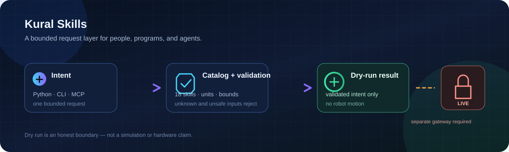

# Kural Skills

<p align="center">
  
</p>

<p align="center">
  <a href="docs/PHASE1.md">API guide</a> ·
  <a href="docs/VERIFICATION.md">verification</a> ·
  <a href="docs/RUNTIME-CONTRACT.md">runtime boundary</a> ·
  <a href="https://github.com/joshuajerin/kural-skills">GitHub</a>
</p>

---

## Quick start

```sh
# From a clone of this repository
uv venv .venv --python 3.12
uv pip install --python .venv/bin/python -e ".[mcp]"

# Inspect the shared catalog, then validate one request.
.venv/bin/kural-skills list
.venv/bin/kural-skills call wave --params '{"timeout_s": 20}'
```

The command returns `dry_run`: **validated intent only; no robot motion**.

```python
from kural_skills import KuralSkills

with KuralSkills() as robot:       # No robot connection.
    result = robot.gestures.wave(timeout_s=20)
    assert result.state == "dry_run"
    assert result.motion_verified is False
    print(result.as_dict())
```

---

## Contents

| Section | What it covers |
| --- | --- |
| [What is included](#what-is-included) | The 18 requests, interfaces, and explicit limits |
| [Use the SDK](#use-the-sdk) | Python, CLI, schemas, and JSON-lines requests |
| [MCP integrations](#mcp-integrations) | ChatGPT Plugins and Grok Bot folders, with dry-run-only guardrails |
| [Safety model](#safety-model) | What this project refuses to claim or bypass |
| [Develop and test](#develop-and-test) | Local install, tests, and project layout |
| [Documentation](#documentation) | API, provider research, verification, and runtime references |

---

## What is included

Kural Skills is a shared request layer. The same validation backs Python methods,
the CLI, JSON-lines sessions, function schemas, and the local stdio MCP adapter.

| Family | Requests |
| --- | --- |
| Base movement | `move_forward`, `move_backward`, `move_left`, `move_right` |
| Base steering | `steer_left`, `steer_right`, `steer_back_left`, `steer_back_right` |
| Base control | `turn_left`, `turn_right`, `base_velocity` |
| Lift | `lift_up`, `lift_down` |
| Existing gestures | `home`, `wave`, `point`, `inspect`, `stow` |

- +X is forward, +Y is left strafe, and +yaw is a left turn.
- Linear values use m/s. Yaw values use rad/s. A duration is not a distance.
- Invalid names, extra fields, booleans, non-finite values, and out-of-bound
  values are rejected.
- Actions have operation IDs, status, cancellation requests, deadlines, and an
  explicit `outcome_unknown` state. Uncertain movement is never retried.

## Use the SDK

### Python

```python
from kural_skills import KuralSkills

with KuralSkills() as robot:
    robot.base.forward(duration_s=1.0, speed_m_s=0.1)
    robot.base.steer_back_right(duration_s=1.0, yaw_rate_rad_s=0.2)
    robot.lift.up(duration_s=0.5)
    result = robot.call("inspect", timeout_s=20)
```

Every example above is dry run unless a separate, future approved gateway is
provided. The default SDK never opens a robot connection.

### CLI and agents

```sh
kural-skills describe move_forward
kural-skills tools
kural-skills call lift_up --params '{"duration_s": 0.5}'
kural-skills serve
```

`tools` provides discovery schemas. `serve` is a local JSON-lines interface; it
is **not** an MCP server. See [Phase 1](docs/PHASE1.md) for the complete request,
result, cancellation, and CLI contract.

## MCP integrations

The repository has separate folders for the two requested agent surfaces:

| Folder | Surface | Intended shape | Current execution mode |
| --- | --- | --- | --- |
| [`chatgpt/`](chatgpt/) | New OpenAI Plugins for ChatGPT and Codex | Plugin skill plus a real MCP connection | Forced dry run |
| [`grok-bot/`](grok-bot/) | Dedicated Grok Bot custom MCP | Bot custom MCP, not Grok Build or the xAI API | Forced dry run |

Both use one real MCP adapter rather than claiming the existing JSON-lines CLI
is MCP. The adapter exposes capability discovery and bounded `kural_dry_run_*`
tools. It does not create an owner lease, publish a control stream, or bypass
native safety gates.

Installing a plugin, connecting an MCP server, or accepting an agent prompt does
not authorize robot motion. Hosting, authentication, provider account setup,
plugin publication, and live gateway work need separate approval.

## Safety model

This repository deliberately does **not**:

- connect to or move a robot by default;
- copy Kural's robot model, controller, assets, or authored gesture keyframes;
- write physics state, actuators, or control streams;
- pose as manual input, inject keyboard events, or bypass arbitration;
- auto-resume after stop/estop or retry an uncertain operation;
- claim simulated or hardware verification from a dry-run result.

Live integration remains blocked until a separately approved, single-owner
runtime gateway implements operator takeover, stop/estop, freshness, clearance,
authenticated lifecycle records, and measured reporting. Read the
[Runtime Contract](docs/RUNTIME-CONTRACT.md) before proposing a gateway.

## Develop and test

```sh
uv pip install --python .venv/bin/python -e ".[mcp]"
.venv/bin/python -m unittest discover -s tests -v
```

| Path | Purpose |
| --- | --- |
| `src/kural_skills/` | Catalog, validation, SDK, backends, CLI, and local stdio MCP adapter |
| `tests/` | Local validation and protocol tests; no robot environment needed |
| `skills/phase1/` | Skill definition, cancellation, and verification requirements |
| `chatgpt/` | OpenAI Plugins packaging and usage guidance |
| `grok-bot/` | Dedicated Grok Bot custom MCP guidance |
| `docs/` | Contracts, research, verification, and setup evidence |

Keep changes small and reviewable. Read [`AGENTS.md`](AGENTS.md) before changing
the SDK or any transport boundary. Keep credentials, models, recordings, and
large assets outside Git.

## Documentation

| Guide | Purpose |
| --- | --- |
| [Phase 1 API](docs/PHASE1.md) | Python, CLI, schemas, states, and bounds |
| [Verification](docs/VERIFICATION.md) | Test evidence and limits |
| [Runtime Contract](docs/RUNTIME-CONTRACT.md) | Why live control is intentionally unavailable |
| [ChatGPT Plugins research](docs/AI-AGENT-INTEGRATIONS.md) | Current OpenAI Plugins packaging, MCP, and publication path |
| [Exact Grok tools](docs/GROK-TOOLS-INTEGRATIONS.md) | Grok Bot, grok.com, Build, and API distinctions |
| [Exa setup](docs/EXA-SETUP.md) | Verified agent-environment search setup |

Kural Skills is a developer and agent foundation. It becomes a live robot
control system only after its runtime safety requirements are independently
implemented and verified.
